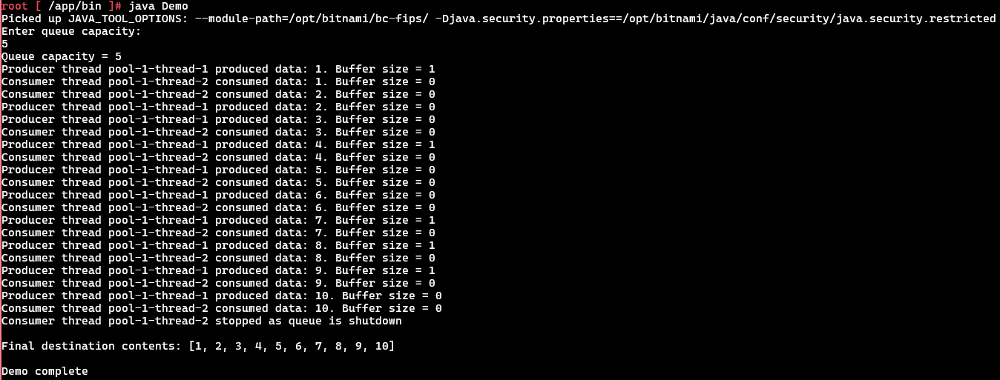
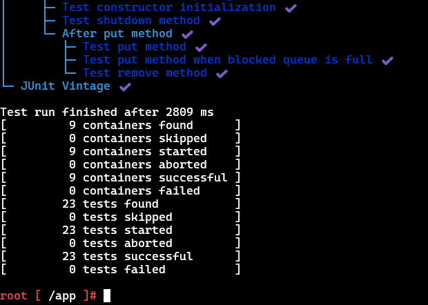

# Assignment 1: Producer-Consumer pattern with thread synchronization (Java)

# Setup Instructions

## Requirements
- Java 8 or higher
- Docker (optional)

## Running the project

1. Clone the GitHub repository.
```bash
git clone https://github.com/Diamagnetic/intuit-build-challenge.git
```
2. Change directory to `assignment_1`.
```bash
cd assignment_1
```

There are two ways to setup, and run the project.

### Method 1: Without Docker
#### 1. Install Java

#### 2. Compile the demo
While inside `assignment_1`, compile using the following command:
```bash
javac -d bin src/*.java
```

#### 3. Run the demo
Change directory to `bin` while inside `assignment_1`, and run the demo.
```bash
cd bin
java Demo
```
Enter queue capacity when prompted. For example:
```bash
Enter capacity: 5
```
Or, pass queue capacity as a command line argument. For example, for queue capacity 5, do:
```bash
cd bin
java Demo 5
```

#### 4. For compiling tests
compile using the following command:
```bash
javac -cp "lib/*" -d out src/*.java test/*.java
```

#### 5. Running Unit Tests
```bash
java -jar lib/*.jar execute -cp=out --scan-class-path
```

### Method 2: Using Docker
#### 1. Start Docker on your machine

#### 2. Build the Docker image
Build the Docker image with the name "java"
```bash
docker build -t java .
```

#### 3. Spin up a Docker container
Run a container named "java" with the "java" Docker image
```bash
docker run -it --name java java /bin/bash
```

#### 4. Running the demo
```bash
java Demo
```
Enter queue capacity when prompted. For example:
```bash
Enter capacity: 5
```
Or, pass queue capacity as a command line argument. For example, for queue capacity 5, do:
```bash
java Demo 5
```

#### 5. Running Unit Tests
```bash
cd /app
java -jar lib/*.jar execute -cp=out --scan-class-path
```

## Output
### Demo
1. The demo runs with one producer and one consumer.
2. Both threads are executed through a fixed thread pool.
3. The producer generates 10 integers.
4. The thread pool waits up to 6 seconds for threads to finish, then shuts down.

(Note: Producer/Consumer logs may interleave in different orders depending on thread scheduling. This is expected in concurrent programming.)
```
root [ /app/bin ]# java Demo
Picked up JAVA_TOOL_OPTIONS: --module-path=/opt/bitnami/bc-fips/ -Djava.security.properties==/opt/bitnami/java/conf/security/java.security.restricted
Enter queue capacity:
5
Queue capacity = 5
Producer thread pool-1-thread-1 produced data: 1. Buffer size = 1
Consumer thread pool-1-thread-2 consumed data: 1. Buffer size = 0
Consumer thread pool-1-thread-2 consumed data: 2. Buffer size = 0
Producer thread pool-1-thread-1 produced data: 2. Buffer size = 0
Producer thread pool-1-thread-1 produced data: 3. Buffer size = 0
Consumer thread pool-1-thread-2 consumed data: 3. Buffer size = 0
Producer thread pool-1-thread-1 produced data: 4. Buffer size = 1
Consumer thread pool-1-thread-2 consumed data: 4. Buffer size = 0
Producer thread pool-1-thread-1 produced data: 5. Buffer size = 0
Consumer thread pool-1-thread-2 consumed data: 5. Buffer size = 0
Producer thread pool-1-thread-1 produced data: 6. Buffer size = 0
Consumer thread pool-1-thread-2 consumed data: 6. Buffer size = 0
Producer thread pool-1-thread-1 produced data: 7. Buffer size = 1
Consumer thread pool-1-thread-2 consumed data: 7. Buffer size = 0
Producer thread pool-1-thread-1 produced data: 8. Buffer size = 1
Consumer thread pool-1-thread-2 consumed data: 8. Buffer size = 0
Producer thread pool-1-thread-1 produced data: 9. Buffer size = 1
Consumer thread pool-1-thread-2 consumed data: 9. Buffer size = 0
Producer thread pool-1-thread-1 produced data: 10. Buffer size = 0
Consumer thread pool-1-thread-2 consumed data: 10. Buffer size = 0
Consumer thread pool-1-thread-2 stopped as queue is shutdown

Final destination contents: [1, 2, 3, 4, 5, 6, 7, 8, 9, 10]

Demo complete

```
#### Screenshots


### Tests
The test suite validates blocking behavior, shutdown semantics, thread interruption handling, and correct FIFO ordering.<br>
Below is the complete output from running the unit test suite using JUnit. The logs include producer and consumer activity printed by the queue during tests, followed by a detailed summary from the JUnit Platform.

(Note: During tests, Producer and Consumer threads print their activity. This is the expected output.)

```bash
root [ /app ]# java -jar lib/*.jar execute -cp=out --scan-class-path
Picked up JAVA_TOOL_OPTIONS: --module-path=/opt/bitnami/bc-fips/ -Djava.security.properties==/opt/bitnami/java/conf/security/java.security.restricted

💚 Thanks for using JUnit! Support its development at https://junit.org/sponsoring

Producer thread Thread-1 produced data: 10. Buffer size = 1
Producer thread Thread-1 interrupted
Producer thread Thread-3 produced data: 10. Buffer size = 1
Producer thread Thread-3 produced data: 20. Buffer size = 2
Producer thread Thread-3 produced data: 30. Buffer size = 3
Producer thread Thread-4 produced data: 10. Buffer size = 1
Producer thread Thread-4 produced data: 20. Buffer size = 2
Producer thread Thread-4 produced data: 30. Buffer size = 3
Producer thread Thread-5 produced data: 10. Buffer size = 1
Producer thread Thread-5 stopped as queue is shutdown
Producer thread Thread-6 produced data: 10. Buffer size = 1
Producer thread Thread-6 interrupted
Consumer thread Thread-7 consumed data: 10. Buffer size = 2
Consumer thread Thread-7 consumed data: 20. Buffer size = 1
Consumer thread Thread-7 consumed data: 30. Buffer size = 0
Consumer thread Thread-7 stopped as queue is shutdown
Consumer thread Thread-8 consumed data: 10. Buffer size = 2
Consumer thread Thread-8 consumed data: 20. Buffer size = 1
Consumer thread Thread-8 consumed data: 30. Buffer size = 0
Consumer thread Thread-8 stopped as queue is shutdown
Consumer thread Thread-9 interrupted
Consumer thread Thread-10 interrupted
Consumer thread Thread-11 stopped as queue is shutdown
╷
├─ JUnit Platform Suite ✔
├─ JUnit Jupiter ✔
│  ├─ ProducerTests ✔
│  │  ├─ Producer should block on full capacity queue ✔
│  │  ├─ Producer should handle empty list ✔
│  │  ├─ Test constructor initialization ✔
│  │  └─ Producer thread running ✔
│  │     ├─ Producer stops midway after queue shutdown ✔
│  │     ├─ Producer should produce multiple data in order ✔
│  │     ├─ Producer should stop on queue shutdown ✔
│  │     └─ Producer should stop on interrupt ✔
│  ├─ ConsumerTests ✔
│  │  ├─ Test constructor initialization ✔
│  │  └─ Consumer thread running ✔
│  │     ├─ Consumer stops midway after queue shutdown ✔
│  │     ├─ Consumer should consume multiple data in order ✔
│  │     ├─ Consumer should stop on interrupt ✔
│  │     ├─ Consumer should block on empty queue ✔
│  │     └─ Consumer should stop on queue shutdown ✔
│  └─ SimpleBlockedQueueTests ✔
│     ├─ Test Producer and Consumer interaction ✔
│     ├─ Test remove method when blocked queue is empty ✔
│     ├─ Test size method ✔
│     ├─ Test isActive method ✔
│     ├─ Test for invalid capacity ✔
│     ├─ Test constructor initialization ✔
│     ├─ Test shutdown method ✔
│     └─ After put method ✔
│        ├─ Test put method ✔
│        ├─ Test put method when blocked queue is full ✔
│        └─ Test remove method ✔
└─ JUnit Vintage ✔

Test run finished after 2809 ms
[         9 containers found      ]
[         0 containers skipped    ]
[         9 containers started    ]
[         0 containers aborted    ]
[         9 containers successful ]
[         0 containers failed     ]
[        23 tests found           ]
[         0 tests skipped         ]
[        23 tests started         ]
[         0 tests aborted         ]
[        23 tests successful      ]
[         0 tests failed          ]

```
#### Screenshots



Notes on output:
- The thread interleaving order varies between runs.
- Buffer size logs reflect queue state at each moment.
- Shutdown causes all waiting threads to exit gracefully.
- A mix of `produced`, `consumed`, `interrupted`, and `stopped` logs is expected.

## Project Structure

```bash
assignment_1/
 |- src/
 |    |- SimpleBlockedQueue.java
 |    |- Producer.java
 |    |- Consumer.java
 |    |- Demo.java
 |- test/
 |    |- SimpleBlockedQueueTests.java
 |    |- ProducerTests.java
 |    |- ConsumerTests.java
 |- lib/
 |    |- junit-platform-console-standalone-6.0.1.jar
 |- screenshots/
 |    |- run_demo.png
 |    |- run_tests_1.png
 |    |- run_tests_2.png
 |- Dockerfile
 |- .dockerignore
 |- README.md
```

## Overview

This assignment demonstrates:
- Thread synchronization
- Concurrent programming
- Blocking queue behavior
- Wait/Notify mechanism

The program simulates data transfer between:
- A **Producer** that reads items from a source list and places them into a buffer (a shared blocking queue).
- A **Consumer** that retrieves data from the queue, and stores in a destination list.

Synchronization, and thread-safety is provided by **SimpleBlockedQueue**.

### How SimpleBlockedQueue Works

SimpleBlockedQueue uses thread synchronization and communication mechanisms:
- Uses **java.util.Queue** as the buffer
- All methods are `synchronized` to ensure mutual exclusion while accessing the buffer
- `wait()` when the buffer is full or empty
- `notifyAll()` to wake producers or consumers
- `shutdown()` to unblock waiting threads and terminate gracefully

#### put(T item)
- Mutual exclusive access to the buffer for any Producer thread
- Waits while queue is full
- Inserts the item when space is available in the queue
- Exits early if shutdown called

#### remove()
- Mutual exclusive access to the buffer for any Consumer thread
- Waits while queue is empty
- Returns the next avilable item
- Returns `null` if the queue is shutdown

## Why All Methods in SimpleBlockedQueue Are Synchronized

Every public method in `SimpleBlockedQueue` is marked `synchronized` to ensure **thread safety** and **consistency** of the internal buffer state.

#### 1. Mutual Exclusion (avoid race conditions)
Only one thread (Producer or Consumer) may:
- Check buffer size
- Insert an item
- Remove an item
- Change `isRunning` state at any given time.

Without `synchronized`, two threads could interleave like:
- Producer checks "buffer not full"
- Consumer removes an item
- Producer inserts even though queue became full

This leads to corrupted state.

#### 2. Wait/Notify Behavior
`wait()` and `notifyAll()` **must** be called while holding the object's monitor lock. This is required by Java's threading rules.

Because `wait()` temporarily releases the monitor lock and re-acquires it later, the entire `put()` and `remove()` methods must be synchronized as a unit. Otherwise waiting and waking Producer/Consumer threads would be unsafe.

#### 3. Correct Blocking Logic
`synchronized` ensures that a thread has mutual exclusive access to the buffer. Without mutual exclusion, a thread could:
- Get preempted
- Resume after another thread has changed the buffer
- Violate the blocking logic

#### 4. Memory Visibility (happens-before relationship)
A synchronized method guarantees:
- All writes before `notifyAll()` become visible to awakened threads
- All reads inside synchronized methods see the latest state

This prevents stale values of:
- `blockedQueue.size()`
- The buffer contents
- `isRunning` member

## Troubleshooting
- If `java Demo` fails, ensure you are inside the `bin` directory.
- If Docker fails to build, ensure Docker Desktop is running.

## Conclusion
This project demonstrates a complete and well-structured implementation of the classic Producer-Consumer pattern using Java's thread-synchronization primitives. By combining `synchronized` methods with `wait()`/`notifyAll()`, the system ensures correct blocking behavior, mutual exclusion, and safe coordination between producers and consumers under concurrent workloads.

The accompanying unit tests thoroughly validate all critical behaviors, including blocking conditions, shutdown handling, and thread interruption, ensuring the reliability and correctness of the solution. The demo showcases how the components work together in a realistic multi-threaded environment.

Overall, this assignment provides a solid foundation for understanding concurrency control, thread communication, and the design of thread-safe shared data structures in Java.
