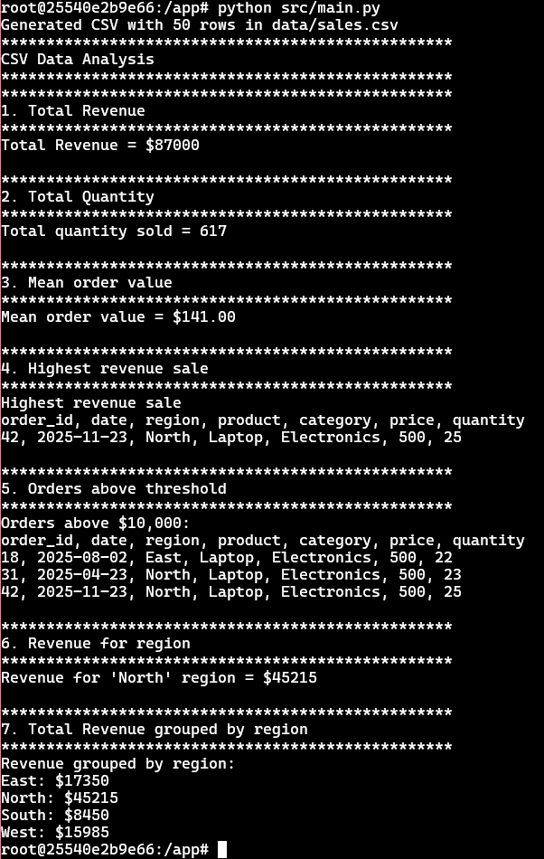
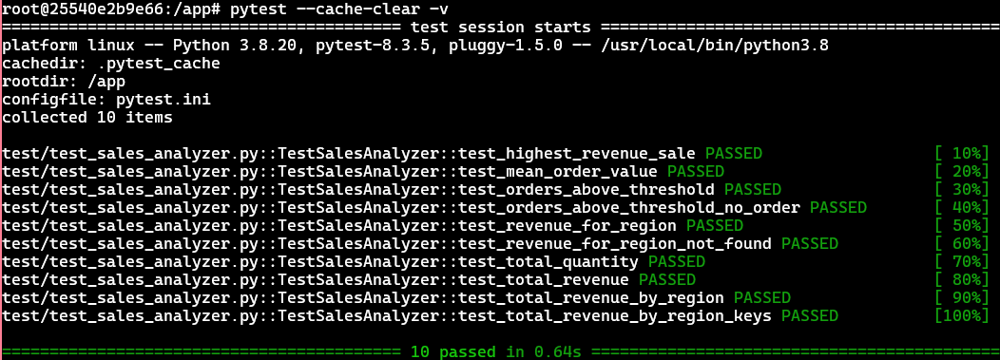

# Assignment 2: Data Analysis on CSV data (Python)
This project performs analytical queries over synthetic sales CSV data using functional programming techniques in Python

# Setup Instructions

## Requirements
- Python 3.8+
- `pydantic` library
- `pytest` library

## Running the project
1. Clone the GitHub repository.
```bash
git clone https://github.com/Diamagnetic/intuit-build-challenge.git
```
2. Change directory to `assignment_2`.
```bash
cd assignment_2
```

There are two ways to setup, and run the project.

### Method 1: Without Docker
#### 1. Install Python

#### 2. Install Python packages using `pip`
```bash
pip install -r requirements.txt
```

#### 3. Running the analytical queries
While inside `assignment_2`, run the following command:
```bash
python src/main.py
```
This will:
- Generate `data/sales.csv`
- Run all analytical queries
- Print output to the console

#### 4. Running the unit tests
Move to the `assignment_2` to run the tests.
```bash
pytest --cache-clear -v
```

### Method 2: With Docker
#### 1. Start Docker on your machine

#### 2. Build the Docker image
Build the Docker image with the name "python"
```bash
docker build -t python .
```

#### 3. Spin up a Docker container
Run a container named "python" with the "python" Docker image
```bash
docker run -it --name python python /bin/bash
```

#### 4. Running the demo
```bash
python src/main.py
```
This will:
- Generate `data/sales.csv`
- Run all analytical queries
- Print output to the console

#### 5. Running the tests
```bash
pytest --cache-clear -v
```

## Output
### 

```bash
root@25540e2b9e66:/app# python src/main.py
Generated CSV with 50 rows in data/sales.csv
**************************************************
CSV Data Analysis
**************************************************
**************************************************
1. Total Revenue
**************************************************
Total Revenue = $87000

**************************************************
2. Total Quantity
**************************************************
Total quantity sold = 617

**************************************************
3. Mean order value
**************************************************
Mean order value = $141.00

**************************************************
4. Highest revenue sale
**************************************************
Highest revenue sale
order_id, date, region, product, category, price, quantity
42, 2025-11-23, North, Laptop, Electronics, 500, 25

**************************************************
5. Orders above threshold
**************************************************
Orders above $10,000:
order_id, date, region, product, category, price, quantity
18, 2025-08-02, East, Laptop, Electronics, 500, 22
31, 2025-04-23, North, Laptop, Electronics, 500, 23
42, 2025-11-23, North, Laptop, Electronics, 500, 25

**************************************************
6. Revenue for region
**************************************************
Revenue for 'North' region = $45215

**************************************************
7. Total Revenue grouped by region
**************************************************
Revenue grouped by region:
East: $17350
North: $45215
South: $8450
West: $15985
```
#### Screenshots


### Tests
```bash
root@25540e2b9e66:/app# pytest --cache-clear -v
========================================== test session starts ==========================================
platform linux -- Python 3.8.20, pytest-8.3.5, pluggy-1.5.0 -- /usr/local/bin/python3.8
cachedir: .pytest_cache
rootdir: /app
configfile: pytest.ini
collected 10 items

test/test_sales_analyzer.py::TestSalesAnalyzer::test_highest_revenue_sale PASSED                  [ 10%]
test/test_sales_analyzer.py::TestSalesAnalyzer::test_mean_order_value PASSED                      [ 20%]
test/test_sales_analyzer.py::TestSalesAnalyzer::test_orders_above_threshold PASSED                [ 30%]
test/test_sales_analyzer.py::TestSalesAnalyzer::test_orders_above_threshold_no_order PASSED       [ 40%]
test/test_sales_analyzer.py::TestSalesAnalyzer::test_revenue_for_region PASSED                    [ 50%]
test/test_sales_analyzer.py::TestSalesAnalyzer::test_revenue_for_region_not_found PASSED          [ 60%]
test/test_sales_analyzer.py::TestSalesAnalyzer::test_total_quantity PASSED                        [ 70%]
test/test_sales_analyzer.py::TestSalesAnalyzer::test_total_revenue PASSED                         [ 80%]
test/test_sales_analyzer.py::TestSalesAnalyzer::test_total_revenue_by_region PASSED               [ 90%]
test/test_sales_analyzer.py::TestSalesAnalyzer::test_total_revenue_by_region_keys PASSED          [100%]

========================================== 10 passed in 0.64s ===========================================
```
#### Screenshots


## Project Structure

```bash
assignment_2/
 |- src/
 |    |- __init__.py
 |    |- csv_generator.py
 |    |- main.py
 |    |- product.py
 |    |- sales_analyzer.py
 |    |- sales_record.py
 |- test/
 |    |- __init__.py
 |    |- test_sales_analyzer.py
 |- data/
 |- pytest.ini
 |- screenshots/
 |- Dockerfile
 |- requirements.txt
 |- .dockerignore
 |- README.md
```

## Overview

The assignment demonstrates:
- Functional programming
- Stream operations
- Data aggregation
- Lambda expressions
- Parsing, and analyzing CSV data
- Grouping, and aggregation operations on sales data
- Comprehensive unit testing

The application performs:
1. CSV data generation, using **CSVGenerator**
2. A **SalesAnalyzer** reads the CSV, and performs analytical queries
3. Results are printed to console
4. Unit tests that validate the analytical methods.

## Design Decisions
### Why I constructed a Synthetic CSV dataset?
#### 1. Fits the exact analytical queries needed
The dataset guarantees:
- multiple regions  
- multiple categories  
- varied revenues  
- high-quantity orders for threshold filtering  
- enough data for grouping and stream operations  

A public dataset might not contain these characteristics.

#### 2. Deterministic dataset for reproducible tests
Using a fixed seed (`random.seed(...)`) ensures:
- identical CSV generated on every run  
- consistent test results  
- reliable debugging  
- predictable grading outcomes  

---

### Data Format Assumptions
- All dates follow `YYYY-MM-DD`
- Price always contains two decimal places
- Region always belongs to a fixed set: North, South, East, West
- Quantity is always an integer between 1 and 25

---

### Usage of Pydantic
#### Automatic data validation
CSV values are strings by default. Pydantic converts them into correct types automatically. This prevents hidden bugs like:
- missing fields parsed incorrectly
- missing data
- wrong types

---

### Why I used `Decimal` instead of `float`?
- `float` introduces rounding errors, i.e., simple values cannot be represented exactly. E.g. `0.1 + 0.3 != 0.4`
- `Decimal` provides exact base 10 precision.
- `Decimal` ensures accuracy, and floating-point drifts, for financial calculations.

#### Safer Financial Calculations
**Pydantic** supports **Decimal** with precision rules, and revenue calculations, viz., two decimal places.

---

### Usage of Pytest for Unit Testing
I chose pytest as the testing framework for this assignment as it keeps the test suite simple, and easy to maintain.

#### 1. Minimal Boilerplate
Tests can be written as simple functions. Pytest does not require test classes or verbose setup/teardown methods.

#### 2. Automatic Test Discovery
Automatically finds tests based on filename patterns `test_*.py`, and runs all functions with the prefix `test_`.

### Why I used deterministic seeding?
Deterministic seeding means setting a fixed seed in `random.seed()`. This ensures that every run generates an identical CSV dataset. This is important to:
- Reproduce data, and unit tests: Exact values for each order is produced
- Debugging consistency

## Troubleshooting
- If CSV not found, check `FILE_PATH` in `main.py`

## Conclusion
This project demonstrates strong proficiency in:
- Functional programming
- Stream operations
- Data aggregation
- Lambda expressions
- Parsing, and analyzing CSV data
- Grouping, and aggregation operations on sales data
- Comprehensive unit testing

The system uses Pydantic models for safe data handling, and applies a full analytical pipeline from dataset generation to reporting.
